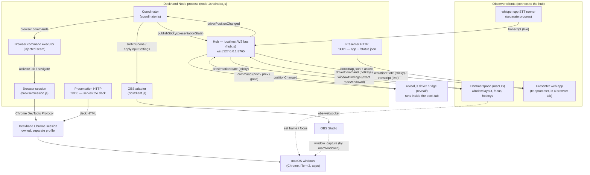

# Architecture

## System diagram

The diagram below shows every runtime component and the connections between
them. There are two kinds of edges:

- **Hub protocol edges** — JSON messages over the localhost WebSocket bus
  (`ws://127.0.0.1:8765`). Driver and observer clients use this bus.
- **Direct control edges** — in-process calls or dedicated protocols (OBS
  WebSocket, Chrome DevTools Protocol, macOS window APIs) that bypass the hub.



Key things to read from the diagram:

- The **hub** is the only path between the coordinator and the driver/observer
  clients. Nothing else tunnels through it.
- The **coordinator** reaches OBS and the browser session directly, not over
  the hub. Each step is isolated so a failure in one does not suppress the
  others (see [Flow](#flow) and [Error handling](#error-handling)).
- **Window identity** flows in a loop: Deckhand launches the windows,
  Hammerspoon resolves the exact `macWindowId` for each, reports it back over
  the hub, and Deckhand pushes it into OBS `window_capture` settings.

## Model

Deckhand has these runtime boundaries:

- coordinator
- OBS adapter
- hub (localhost WebSocket bus tying everything together)
- driver client boundary
- browser session runtime (CDP-owned Chrome windows and tabs)
- observer client boundary

Observer clients power presenter mode. Current observer implementations are
the presenter web app, the Hammerspoon presenter controller, and the local
whisper.cpp STT runner. The coordinator owns the declarative presentation
model; platform-specific presenter behavior lives outside the coordinator.

## Responsibilities

Deckhand is split across two cooperating runtimes: the **Node process** (the
core) and **Hammerspoon** (a macOS observer that owns the work Node cannot do
itself). They communicate over the localhost hub — Node runs the server,
Hammerspoon connects as a client.

| Responsibility | Node | Hammerspoon |
| --- | --- | --- |
| Slide hotkeys (next / prev) | — | `Ctrl+Shift+Left/Right` → `driverCommand` |
| Deckhand Chrome session | launch and tear down (`--remote-debugging-port`, profile) | — |
| Browser windows and tabs | create, activate, navigate, close via CDP | — |
| Slide orchestration | switch OBS scene, dispatch browser commands, publish state | — |
| Hub (localhost WebSocket) | server | client (observer) |
| Window discovery | bootstrap match via `CGWindowList` + Accessibility | authoritative: resolve `hs.window` → exact `macWindowId` |
| OBS window capture | `applyInputSettings` using the resolved IDs | — |
| Window layout and focus | compute slot rects | `setFrame`, raise, focus |
| Presenter app, STT, `/status.json` | served here | — |

Window discovery is the one shared job, and it runs in two phases. Node opens
the browser windows and makes a best-effort match; Hammerspoon then resolves
the exact `macWindowId` for each source and reports it back. Startup blocks on
that handshake before doing the final OBS reconcile.

## Source of truth

The `sources` catalog is the authoritative registry of logical source IDs.
Layouts, slide actions, and presenter bindings all build on that catalog. The
canonical presentation sources are `Slide`, `Terminal`, `BrowserA`, and
`BrowserB`. These names describe what the operator is coordinating; they do
not encode position, runtime transport, or OBS implementation details.

Browser sources declare a catalog of named tabs. Deckhand launches one
dedicated Chrome session, creates one window per browser source, and preloads
the declared tabs. Window and tab identity are runtime handles owned by
Deckhand, never URL or title lookup.

The `layouts` catalog builds on `sources` and is the single source of truth for
audience OBS scene names, logical source placement, and presenter-stage
rectangles. Slides reference layouts by stable `layout` IDs rather than
hardcoding scene names. Browser-oriented slide actions target logical `source`
IDs and source-local tab aliases.

## Flow

1. Driver reports a normalized `positionChanged` event.
2. Coordinator resolves that slide into a full `presentationState` payload.
3. Coordinator increments a monotonic `seq` and stores that payload as sticky
   state.
4. Hub publishes `presentationState` to subscribed observers.
5. Coordinator switches OBS to `presentationState.audienceScene`.
6. Coordinator dispatches typed browser commands (`activateTab` / `navigate`)
   through the injected executor, which routes them to the Deckhand-owned
   browser session by runtime handle.

Each step is isolated so OBS failures, observer failures, or browser-session
failures do not suppress the other work.

Normalized driver event shape:

```js
{
  id: 'demo-step-1',
  index: { h: 5, v: 0 },
  meta: { indexh: 5, indexv: 0, idSource: 'data-deckhand-id' }
}
```

Presenter-state payload shape:

```js
{
  type: 'presentationState',
  seq: 17,
  slideId: 'code-walkthrough',
  layoutId: 'left-terminal-right-slide',
  audienceScene: 'Left Terminal Right Slide',
  slots: [
    { source: 'Terminal', position: 'left', rect: { x: 0, y: 0, w: 900, h: 1168 } },
    { source: 'Slide', position: 'right', rect: { x: 900, y: 0, w: 900, h: 1168 } }
  ],
  windowBindings: {
    Terminal: { app: 'iTerm2' },
    Slide: {
      app: 'Google Chrome',
      titleIncludes: 'Deckhand Deck',
      pid: 47213,
      macWindowId: 12345,
      strict: true
    },
    Presenter: {
      app: 'Google Chrome',
      titleIncludes: 'Deckhand Presenter',
      pid: 47213,
      macWindowId: 45678
    }
  },
  overlays: [
    { source: 'Presenter', hidden: true }
  ],
  focus: 'Terminal',
  script: 'Walk through the init flow.\nEmphasize line 42.'
}
```

`windowBindings` may begin as bootstrap app/title selectors and then be
republished with exact runtime bindings once managed windows are resolved.
`Presenter` is a reserved presenter-only binding; it never appears in OBS
layouts or the source catalog.

## Hub protocol

The local hub binds to localhost only and carries a small JSON protocol.
Messages used in the current design:

- `register` / `registered`
- `positionChanged`
- `driverCommand` (observer → hub → active driver; powers Hammerspoon hotkeys)
- `windowBindings` (observer → hub; Hammerspoon reports resolved `macWindowId`s)
- `command`
- `presentationState`
- `transcript`
- `error`

Roles are generic: `driver` and `observer`. (The earlier `target` role has
been removed — browser windows and tabs are owned directly by Deckhand through
CDP; command routing no longer depends on remote target clients.)

Observer registrations include subscriptions, such as:

```json
{
  "type": "register",
  "role": "observer",
  "subscriptions": ["presentationState", "transcript"]
}
```

Sticky behavior:

- the latest `presentationState` is retained
- late-joining observers immediately receive that sticky state on register
- transcripts are relayed live only and are not sticky

## Lifecycle

Startup order:

1. presentation HTTP start
2. OBS connect
3. browser session start (launches Chrome, creates source windows, preloads tabs)
4. hub start
5. presenter HTTP start, when presenter mode is enabled
6. wait for the first real driver position
7. wait for a presenter observer when presenter mode is enabled
8. wait for exact Hammerspoon window bindings for browser sources
9. final OBS reconcile with exact managed window ids

Shutdown order:

1. presenter HTTP stop
2. owned app-window close (closes tracked `app` windows by exact id)
3. browser session stop (closes tracked Deckhand tabs and windows)
4. hub stop
5. OBS disconnect
6. presentation HTTP stop

## Driver, browser session, and observer boundaries

Driver responsibilities:

- emit normalized position events
- accept `next`, `prev`, and optional `goTo(id)` commands

Browser session responsibilities:

- launch and own the dedicated Deckhand Chrome session
- optionally seed that session from a configured Chrome profile name
- create one window per browser source and preload declared tabs
- maintain the authoritative source/tab runtime-handle registry
- resolve `activateTab` and `navigate` commands to runtime handles, never URL or
  title lookup
- close only the tracked Deckhand-owned tabs and windows on shutdown

OBS adapter responsibilities:

- switch audience scenes
- provision or reuse stable source-named inputs
- push macOS `window_capture` settings from bootstrap selectors first
- upgrade those inputs to exact managed window bindings when runtime
  `macWindowId`/`pid` data arrives

Observer responsibilities:

- subscribe to one or more observer channels
- consume sticky `presentationState` safely
- optionally publish `transcript` events

## Owned app sources

Non-browser sources Deckhand launches and tracks (editors, terminals) flow
through a dedicated owned-app seam that is kept out of the coordinator and
`index.js`. It is split into three layers by responsibility:

- **`src/appRuntime.js`** — the orchestrator. It resolves an adapter per
  source (and never branches on app names), drives the launch-and-diff
  resolution, builds OBS/bootstrap bindings, and closes tracked windows on
  shutdown.
- **`src/apps/`** — per-app **adapters**. The registry (`index.js`) picks an
  adapter by app name; generic apps fall through to `default.js`. Each adapter
  encodes one app's quirks: aliases, the CGWindow owner name, the
  presenter/Hammerspoon bootstrap app name, launch args, window-stability
  confirmation, and the close strategy.
- **`src/launchers/`** — generic **launch primitives**. `app.js` does the
  `open -a` spawning (forcing `-n` for a new instance so the diff resolver can
  find a fresh CGWindowID); `iterm2.js` builds and runs the iTerm2 AppleScript
  and closes a window by session UUID. No app-specific knowledge lives here.

The dependency direction is one-way: **adapters call into launchers, never the
reverse.** An iTerm2 adapter, for example, composes the iTerm2 launcher
primitives; a VS Code adapter only shapes launch args and hands them to the
generic `app.js` launcher.

Adding a new owned app that misbehaves is one adapter file in `src/apps/` plus
one line in the `APP_ADAPTERS` registry; generic apps need no file. See
[Adapters: App adapters](ADAPTERS.md#app-adapters).

Two names an adapter must keep distinct:

- the **CGWindow/OBS owner name** (`Code`, `iTerm`) — used for window
  enumeration and the OBS `owner_name` fallback
- the **presenter/Hammerspoon bootstrap name** (`Visual Studio Code`, `iTerm2`)
  — used for application lookup

## Presenter surfaces

- `/presenter/` — first-class presenter web app
- `/status.json` — operator-facing runtime status snapshot
- `hammerspoon/` — macOS window management integration
- `src/presenter/stt/` — local STT runner

## Error handling

- unknown slides warn and do nothing
- OBS errors are logged and do not crash the coordinator
- browser command failures are logged and the coordinator keeps running
- observer publish failures are logged and do not suppress OBS or browser work
- malformed hub messages return protocol errors instead of crashing the server

## Extensibility notes

- browser command routing is based on `command.type` (`activateTab`, `navigate`)
- the coordinator dispatches through an injected executor seam so new command
  types stay decoupled from slide-event orchestration
- observer traffic is channel-based and subscription-filtered
- shared modules do not import `reveal.js` bridge code
- shared modules do not import macOS Hammerspoon code
